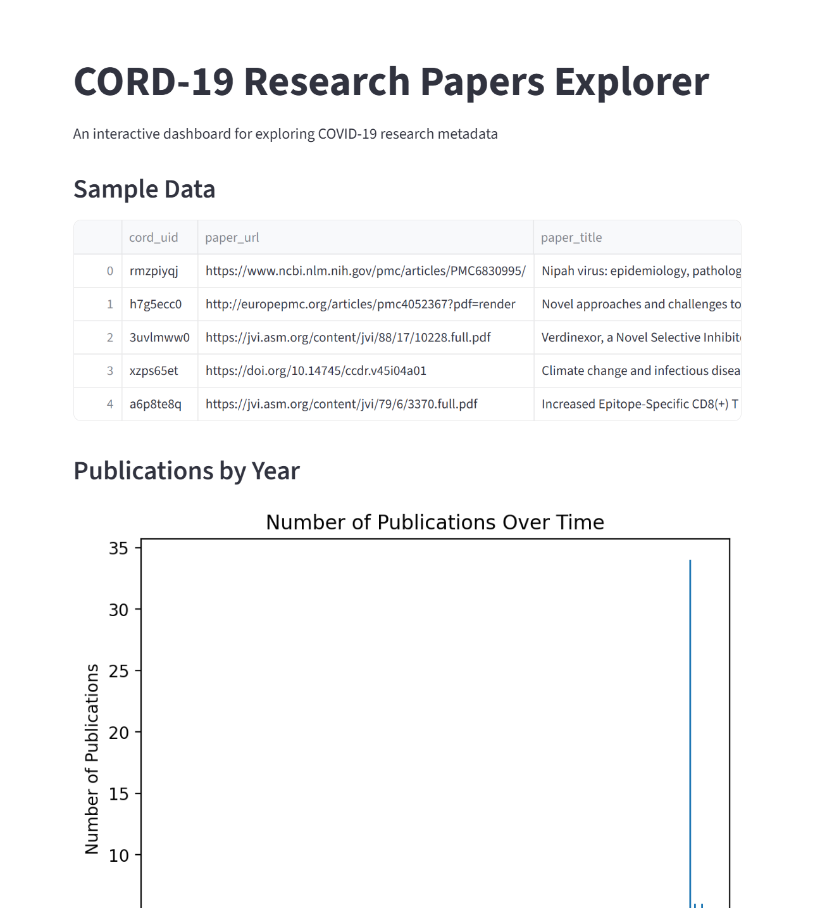
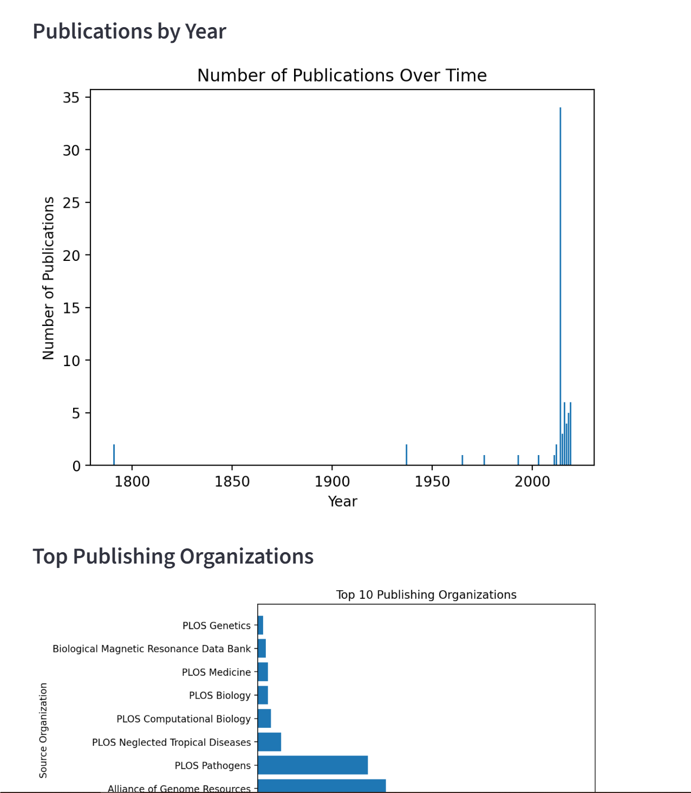

# 📊 CORD-19 Data Explorer

This project is part of the **Frameworks Assignment**. It explores the **CORD-19 dataset** (metadata of COVID-19 research papers) and builds a simple **Streamlit web app** for interactive visualization and analysis.  

---

## 🌍 Live Demo  
🔗 [View the Live App Here](https://frameworksassignmentgit-v2e76wgayftb3bxvecdopd.streamlit.app/)  

---

## 🎯 Project Purpose
- Practice **loading and exploring a real-world dataset**  
- Apply **data cleaning** and transformation techniques  
- Create **visualizations** with matplotlib/seaborn  
- Build an **interactive web application** with Streamlit  
- Deploy the project online for accessibility  

---

## 📂 Project Structure
Frameworks_Assignment/
│── app.py # Streamlit application
│── analysis.ipynb # Jupyter notebook for exploration (optional)
│── CORD19_metadata.csv # Dataset (metadata subset)
│── requirements.txt # Dependencies for deployment
│── screenshots
│── README.md # Project documentation


---

## 📊 Features
- Load and explore **CORD-19 metadata dataset**  
- Handle missing data and extract publication years  
- Visualizations:
  - 📈 Number of publications over time  
  - 📊 Top publishing journals  
  - ☁️ Word cloud of paper titles  
  - 🔎 Distribution of papers by source  
- Interactive filters for year ranges  
- Simple **Streamlit interface**  

---

## 🛠️ Tech Stack
- **Python 3.10+**  
- **pandas** → data handling  
- **matplotlib & seaborn** → visualizations  
- **Streamlit** → web application framework  

---

## 📸 Screenshots    

### Home Page  
  

### Publications Over Time  
  

---

## 🚀 Getting Started  

### Clone the Repository
```bash
git clone https://github.com/Sammyojima/Frameworks_Assignment.git
cd Frameworks_Assignment

Install Dependencies
pip install -r requirements.txt

Run Locally
streamlit run app.py

📝 Reflection
This project improved my understanding of:
Data cleaning and handling missing values
Visual storytelling with charts
Building and deploying interactive web apps
End-to-end data science workflow
